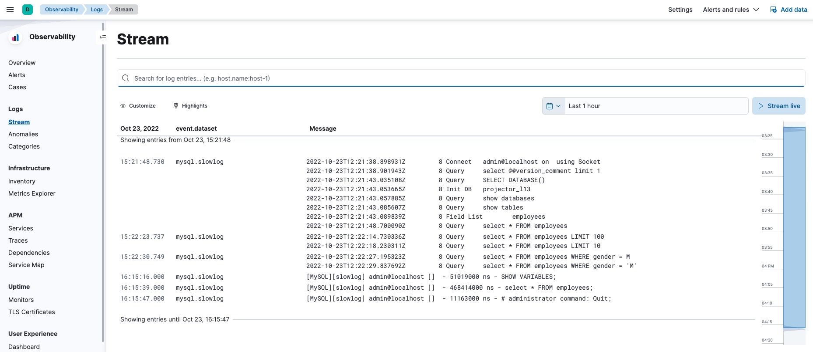
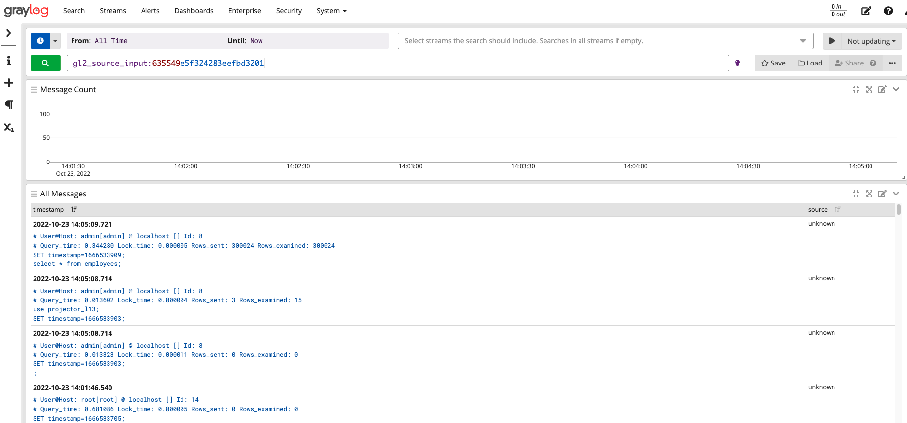

# Logging

Run ```docker-compose up -d``` to launch containers. A database with sample employees talbe will be created. Sample data files are loaded from the ```setup/mysql``` directory. 

## Logstash

In docker-compose comment ```mongo``` and ```graylog``` services. 
Uncomment ```kibana``` and ```logstash```. 

In ```config/filebeat/filebeat.yml``` uncomment 
```
#setup.dashboard.enabled: true
#setup.kibana.host: "http://kibana:5601"
#
#output.elasticsearch:
#  hosts: ["elasticsearch:9200"]
```



## Graylog

Doesn't work with Elasticsearch 8.x. 7.x is required. 

In docker-compose uncomment ```mongo``` and ```graylog``` services.
Comment ```kibana``` and ```logstash```.

In ```config/filebeat/filebeat.yml``` uncomment\
```
#output.logstash:
#  hosts: ["graylog:5045"]
```


You may need to add input Beats for the 5045 port. 